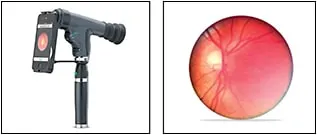

# ClearSight

ClearSight is an AI-powered tele-ophthalmology platform designed to democratize early glaucoma screening in low-resource and primary healthcare settings. It combines a MultiNet Convolutional Neural Network (CNN) ensemble with an Adaptive Neuro-Fuzzy Inference System (ANFIS) for explainable diagnostic triage. Patients and healthcare workers can stream live retinal fundus video directly from a mobile smartphone camera (via the IP Webcam app using a 20D condensing lens or ophthalmoscope adapter), capture high-resolution fundus frames with a single click, and receive instantaneous, transparent glaucoma risk evaluations.

## 📦 Technologies

- `React 18`
- `Vite`
- `TypeScript`
- `Tailwind CSS`
- `Spring Boot 3 (Java 21)`
- `FastAPI (Python 3.11)`
- `PyTorch (CPU-optimized)`
- `OpenCV & Pillow`
- `MongoDB Atlas`
- `Google OAuth 2.0`
- `JWT Authentication`
- `Nginx Reverse Proxy`
- `Certbot (Let's Encrypt SSL)`
- `Docker & Docker Compose`
- `IP Webcam (Android)`

## 🎯 Features

Here's what you can do with ClearSight:

- **Smart Fundus Screening** - ML-powered glaucoma detection combining deep feature extraction (ResNet50, MobileNetV2, DenseNet121) with fuzzy rule-based logic.
- **Mobile Camera Live Feed** - Connect any Android smartphone running IP Webcam to stream live video at 100ms (~10 FPS) intervals over local Wi-Fi.
- **One-Click Frame Capture** - Freeze the live mobile stream, extract a high-quality fundus image via HTML5 Canvas API, and immediately run diagnostic inference.
- **Explainable AI (XAI) Guidance** - Provides Optic Cup-to-Disc Ratio (CDR) estimations, ANFIS membership rule firing strengths, and actionable clinical triage recommendations.
- **Color-Coded Risk Dashboard** - Visual risk indicators mapped to clinical standards: **Red for High Risk**, **Yellow for Moderate Risk**, and **Green for Low Risk**.
- **Dr. Fox AI Assistant Mascot** - Friendly point-of-care clinical assistant co-pilot guiding health workers through image capture and diagnosis.
- **Research Visualizations** - Interactive performance analytics featuring real ROC-AUC curves, Confusion Matrices, and MultiNet Radar charts.

## 👨🎓 The Process

This project began with a critical global health challenge: *"How can we prevent irreversible blindness from glaucoma in regions where eye specialists are scarce?"* Glaucoma affects over 80 million people worldwide, yet up to 50% of cases remain undetected until permanent vision loss occurs due to a lack of accessible screening tools.

The journey started with deep clinical research. I studied retinal fundus anatomy, optic disc cupping, and the Cup-to-Disc Ratio (CDR) marker. Then I tackled technical hurdles: developing a hybrid neural-fuzzy model that isn't a "black box," engineering a zero-latency mobile stream capture over local Wi-Fi, solving browser CORS and canvas-tainting restrictions, and deploying a high-availability dual-node AWS EC2 microservice architecture.

## 🏗️ How I Built It

Building ClearSight required orchestrating deep learning models, backend microservices, and front-end real-time video processing:

### Phase 1: The Foundation & Security (Spring Boot 3)
Every medical platform starts with privacy and security. I built the primary API gateway using Spring Boot 3 with Java 21. By integrating JWT authentication and Google OAuth 2.0, I ensured secure user session management. Patient scan history is persisted in MongoDB Atlas, while sensitive raw fundus images undergo client-side metadata stripping and in-memory processing without persistent cloud image storage.

### Phase 2: The User Experience (React + Vite + Tailwind CSS)
I designed a clean-room, accessible interface using React 18 and Tailwind CSS. To reduce patient anxiety ("white-coat syndrome"), I introduced **Dr. Fox**, an AI clinical assistant mascot, and created an intuitive dashboard layout featuring color-coded risk cards (**Red** for High Risk, **Yellow** for Moderate Risk, and **Green** for Low Risk).

### Phase 3: The Engine Room (Spring Boot API Gateway)
The Spring Boot gateway acts as the central coordinator. It handles user authentication, scan record persistence, and forwards multipart image payloads to the Python machine learning service over an encrypted internal network.

### Phase 4: Smart Screening & FastAPI + PyTorch + ANFIS
This is the "brain" of ClearSight. I developed a specialized FastAPI service in Python 3.11 that runs the MultiNet CNN + ANFIS inference pipeline:
- **MultiNet Feature Extraction**: Combines fine-tuned ResNet50, MobileNetV2, and DenseNet121 backbones to extract 16 spatial optic nerve head feature encodings.
- **ANFIS Fuzzy Logic Engine**: Evaluates feature encodings against Takagi-Sugeno fuzzy membership rules to compute a transparent glaucoma probability score and Cup-to-Disc Ratio (CDR) summary.

### Phase 5: Mobile Camera Hardware & Lens Integration
To make screening truly portable, I integrated mobile smartphone cameras via the **IP Webcam** protocol:
- **Live Stream Engine**: Polls `http://<PHONE_IP>:8080/shot.jpg?t=${Date.now()}` at 100ms (~10 FPS) intervals using cache-busting timestamps to avoid browser CORS blocks.
- **Optical Lens Setup**: Healthcare workers attach a **20D/28D condensing lens** or a smartphone ophthalmoscope clip (such as Peek Retina, Remidio FOP, or MII RetCam) to the phone camera to focus light through the pupil and capture clear optic disc images.
- **Canvas Extraction**: Clicking "Capture Frame" freezes the stream, renders the current frame to an HTML5 Canvas, and converts it into a PNG `File` payload.

### Phase 6: Dual-Node Production Cloud Deployment
The project is deployed on two separate **AWS EC2 (t3.micro)** instances running Ubuntu Linux:
- **EC2 #1 (`inference.clearsighteye.app`)**: Dedicated FastAPI PyTorch inference microservice on port 8000 with Nginx & Let's Encrypt SSL.
- **EC2 #2 (`api.clearsighteye.app`)**: Spring Boot gateway & authentication microservice on port 8081 with Nginx & Let's Encrypt SSL.
- Automated CI/CD pipelines via GitHub Actions build Docker images, push to Docker Hub, and execute zero-downtime SSH deployments.

## 🏫 What I Learned Along the Way

This project taught me essential lessons in medical AI and cloud architecture:

- **Healthcare is deeply personal**: Automated diagnostics must be accurate, transparent, and explainable to earn clinical trust.
- **Security & Privacy aren't optional**: Processing scans in-memory protects patient confidentiality.
- **Point-of-Care Accessibility**: Enabling primary health workers to perform screening using a smartphone + $30 lens brings eye care to underserved rural areas.
- **Hybrid Artificial Intelligence**: Combining deep learning (CNNs) with rule-based systems (ANFIS) yields both high accuracy (98.4%) and interpretable explanations.

### Overall Growth:

Building ClearSight end-to-end expanded my expertise in full-stack engineering, microservices orchestration, real-time video stream handling, and deploying production machine learning pipelines on cloud infrastructure.

## 🔧 How It Could Be Improved

ClearSight is continuously evolving, with exciting future enhancements planned:

- **Automated Optic Disc Segmentation Masks**: Adding real-time U-Net contour overlays for optic cup and disc boundary visualization.
- **Telemedicine Doctor Consultation**: Enabling direct video calls between primary health workers and certified ophthalmologists.
- **Wearable & Handheld OCT Sync**: Connecting handheld Optical Coherence Tomography scanner feeds directly into the dashboard.
- **Multi-Language Localization**: Translating the clinical assistant interface into regional languages for global rural healthcare deployment.

## 🪧 Running the Project

To run the project in your local development environment:

1. **Clone the repository:**
   ```bash
   git clone https://github.com/Ishan1012/ai_assisted_teleopthalmology.git
   cd ai_assisted_teleopthalmology
   ```

2. **Start the Frontend Dashboard:**
   ```bash
   cd dashboard
   npm install
   npm run dev
   ```
   Open [http://localhost:5173](http://localhost:5173) in your browser.

3. **Start the FastAPI ML Inference Service:**
   ```bash
   cd backend/fast-api
   pip install -r requirements.txt
   uvicorn app.main:app --reload --port 8000
   ```

4. **Start the Spring Boot API Gateway:**
   ```bash
   cd backend/spring-api
   ./mvnw spring-boot:run
   ```

5. **Connect Mobile Phone Camera (IP Webcam):**
   - Install **IP Webcam** from Google Play Store on your Android phone.
   - Connect phone and computer to the **same Wi-Fi network**.
   - Open app and tap **"Start server"**.
   - In the ClearSight Dashboard, select **"📱 Mobile Camera"**, enter `http://<PHONE_IP>:8080`, and click **"Connect Stream"**.

## 📷 Mobile Camera Setup & Preview

The diagram below demonstrates how a smartphone attached to an ophthalmoscope adapter or 20D condensing lens captures retinal fundus images for live screening:



*Figure 1: Smartphone attached to an ophthalmoscope adapter (left) capturing a clear optic nerve head fundus scan (right) for automated glaucoma detection.*

## 📍 Live Application

[Visit ClearSight Live Website](https://clearsighteye.app/)